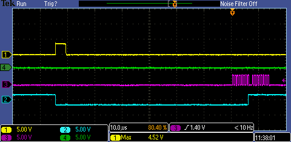
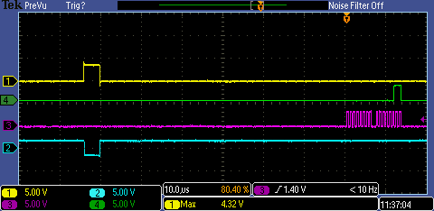
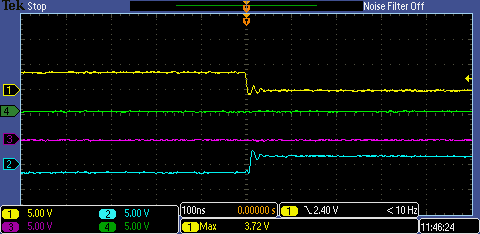

# registers not re-setting to 0 correctly

Raspberry pi reads 8 bit registers via hardware SPI from Icoboard (Lattice ICE HX8K).
FPGA SPI slave module written by Eric Brombaugh.

After a reset, read_count register is set to 0. Every read, this counter is incremented.

The test is:

* reset FPGA
* make SPI read of read_count register
* check read_count is 0

SPI clock is set to 2MHz. FMax is 120MHz.

## summary

In a test of 500 repeats:

* arachne-pnr: 24 failed with read_count = 3, and 4 failed with read_count = 2.
* nextpnr: no fails

# toolchain

Yosys 0.8+409 (git sha1 a01386c, clang 3.8.0-2ubuntu4 -fPIC -Os)
arachne-pnr 0.1+325+0 (git sha1 840bdfd, g++ 5.4.0-6ubuntu1~16.04.10 -O2)
nextpnr-ice40 -- Next Generation Place and Route (git sha1 e7fe046)

# formal verification

There are 2 formal tests included:

1. prove that only way read_count can change if with spi_mosi changing
2. prove at reset counts go to 0

k-induction succeeds with a depth of 40.

A cover statement is included that shows read_count should only 

# scope shots

* yellow - reset
* purple - spi clock
* green - MISO
* cyan - (read_count != 0)

## read count = 0 after reset

When read count is 0

When read count is 3

Close up on reset transition to low when read_count is read != 0

# test results 

register is read with a simple python script: [test_read_count.py](python/test_read_count.py)

    rm test.results ; for i in $(seq 500); do echo $i;  python test_read_count.py >> test.results 2>&1 ; done

## arachne-pnr

    grep -i assertion test.results  | sort | uniq -c
    4 AssertionError: 2 != 0
    24 AssertionError: 3 != 0

# nextpnr

    grep -i assertion test.results  | sort | uniq -c
    <no results>

