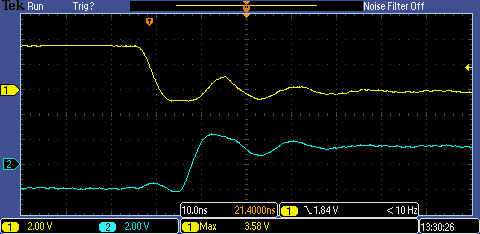

# registers not re-setting to 0 correctly with larger SPI registers

The design is made with either 8 or 12 bytes registers that are read by hardware SPI from a
Raspberry Pi. 

FPGA [SPI slave](spi_slave.v) module written by Eric Brombaugh.

After a reset, read_count register is set to 0. Every read, this counter is incremented.

The test is:

* reset FPGA
* make SPI read of read_count register
* assert read_count is 0

SPI clock is set to 2MHz. FMax is 80MHz with 8 byte and 55MHz with 12.
FPGA is Lattice ICE HX8K (Icoboard) mounted on top of Raspberry Pi (very short SPI lines).

## summary

In a test of 500 repeats:

* with register length 8 bytes: no fails
* with register length 12 bytes: 36 fails

# toolchain

* Yosys 0.8+409 (git sha1 a01386c, clang 3.8.0-2ubuntu4 -fPIC -Os)
* nextpnr-ice40 -- Next Generation Place and Route (git sha1 e7fe046)

# formal verification

There are 2 formal tests included:

1. prove that only way read_count can change if with spi_mosi changing
2. prove at reset counts go to 0

k-induction succeeds with a depth of 40.

A cover statement is included that shows read_count changing. Solver manipulates MOSI and SS to reach cover.

# scope shots

* yellow - reset
* purple - spi clock
* green - MISO
* cyan - (read_count != 0)

## read count = 0 after reset

Test pass. Note cyan trace goes low at reset:

Test fails when register is not reset to 0 correctly. Note cyan trace goes high after reset:

Close up on reset transition to low when test fails.

# test results 

register is read with a simple python script: [test_read_count.py](python/test_read_count.py)

    rm test.results ; for i in $(seq 500); do echo $i;  python test_read_count.py >> test.results 2>&1 ; done

## register length 8

    grep -i assertion test.results  | sort | uniq -c
    <no results>

## register length 12

    grep -i assertion test.results  | sort | uniq -c
    1 AssertionError: 1 != 0
    35 AssertionError: 3 != 0

